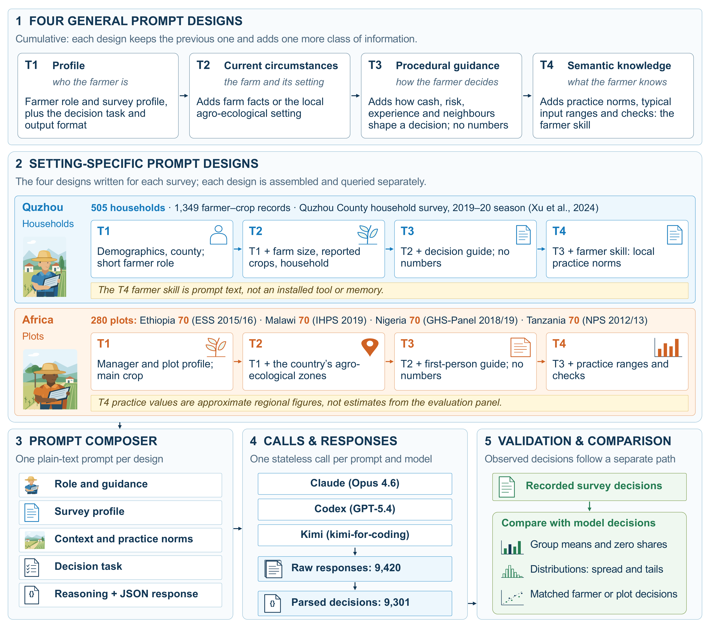

# Farmer-persona

**Can large language models serve as farmer personas? Testing simulated decisions against farm surveys**

Ziwei Li, Zhanliang Zhu, Yuchen Liu, Liujun Zhu, Ruiqi Wu, Tongqing Shen, Junliang Jin, Jianyun Zhang

This repository holds every prompt, every stored model response and the validation code behind the paper. Three commercial models were prompted as farmers: Claude Opus 4.6 (through Claude Code), GPT-5.4 (through the Codex CLI) and kimi-for-coding (through the Kimi CLI). They answered for 505 households in Quzhou County, China, and 280 plots in Ethiopia, Malawi, Nigeria and Tanzania. Each profile received one stateless call per prompt design and model, giving 9,420 stored responses and 9,301 parsed decisions. The decisions are compared with the survey records at three levels (group summaries, marginal distributions and matched farmer or plot decisions), each against a reference that uses no information about individuals.



## Main findings

- The agents reproduced some group averages but not the decisions of individual farmers.
- Simulated decisions were compressed toward typical values and missed the high-input tail of the surveys.
- Adding information to the prompt changed the outputs, but no design closed the gap or was best across models, decisions and validation levels.

## What is where

| Folder | Contents |
|---|---|
| [`prompts/`](prompts/README.md) | The four prompt designs (T1 to T4) for both settings, the two farmer skills and complete example prompts |
| [`raw_agent_output/`](raw_agent_output/README.md) | Every stored response: 6,060 for Quzhou and 3,360 for the African plots, plus the ground truth |
| [`data/`](data/README.md) | The survey files the profiles and ground truth come from, with sources and licences |
| `code/runners/` | Prompt builders and model callers (`run_quzhou_full.py`, `run_lsms_full.py`) |
| `code/analysis/` | Validation metrics and figures |
| [`additional_analysis/`](additional_analysis/README.md) | The within-crop correlation check reported in Section 3.4 |
| `metrics/`, [`figures/`](figures/README.md) | Saved metric files, figures and the values plotted in them |

## The four prompt designs

Each design keeps the information of the previous one and adds one more class of information about the farmer.

| Design | Class | Adds |
|---|---|---|
| T1 | Profile | Who the farmer is: the survey profile, the decision task and the output format |
| T2 | Current circumstances | The farm and its setting: farm facts (Quzhou) or the country's agro-ecological zones (Africa) |
| T3 | Procedural guidance | How the farmer decides: cash, risk, experience and neighbours, without numbers |
| T4 | Semantic knowledge | What the farmer knows: local practice norms, typical input ranges and checks, packaged as a farmer skill |

The two farmer skills are plain Markdown: [`prompts/quzhou/T4_farmer_skill/SKILL.md`](prompts/quzhou/T4_farmer_skill/SKILL.md) and [`prompts/lsms/T4_farmer_skill/SKILL.md`](prompts/lsms/T4_farmer_skill/SKILL.md). In the study each was sent as text inside a single prompt. [`prompts/README.md`](prompts/README.md) shows how every design is assembled, and [`prompts/examples/`](prompts/examples) has complete prompts for one household and one plot.

## Reproduce the results

No model calls are needed. With Python 3.11 or later:

```bash
pip install -r requirements.txt
python3 scripts/verify_inventory.py
python3 code/analysis/paper1_metrics.py
python3 code/analysis/paper1_multioutcome.py
python3 code/analysis/current_fig1_source.py
python3 code/analysis/fig_validation_levels.py
python3 code/analysis/paper1_figures.py
python3 additional_analysis/code/quzhou_within_crop.py
```

`verify_inventory.py` recounts the stored and parsed responses in every cell. The metric scripts write to `metrics/` and the figure scripts to `figures/`.

## Run new agents

`python3 code/runners/run_quzhou_full.py run <design> <model>` and `python3 code/runners/run_lsms_full.py run <design> <model>` rebuild the prompts and call the model clients, which must be installed and signed in. Run them without tool access and in an empty working directory.

## Status

The stored African T4 responses will be replaced by the run built on the T3 decision guide, and the affected metrics and figures will be updated in the same commit. See [`raw_agent_output/README.md`](raw_agent_output/README.md).

## Citation

Li, Z., Zhu, Z., Liu, Y., Zhu, L., Wu, R., Shen, T., Jin, J., Zhang, J., 2026. Can large language models serve as farmer personas? Testing simulated decisions against farm surveys. Manuscript.

## Licence

Code, prompts and model responses: MIT ([`LICENSE`](LICENSE)). The survey files keep their own licences: CC BY 4.0 for Quzhou and CC0 for the LSMS-ISA harmonised panel ([`data/README.md`](data/README.md)).
